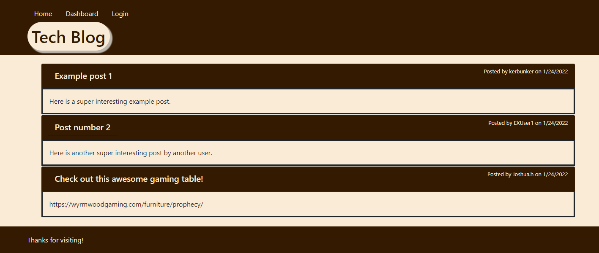
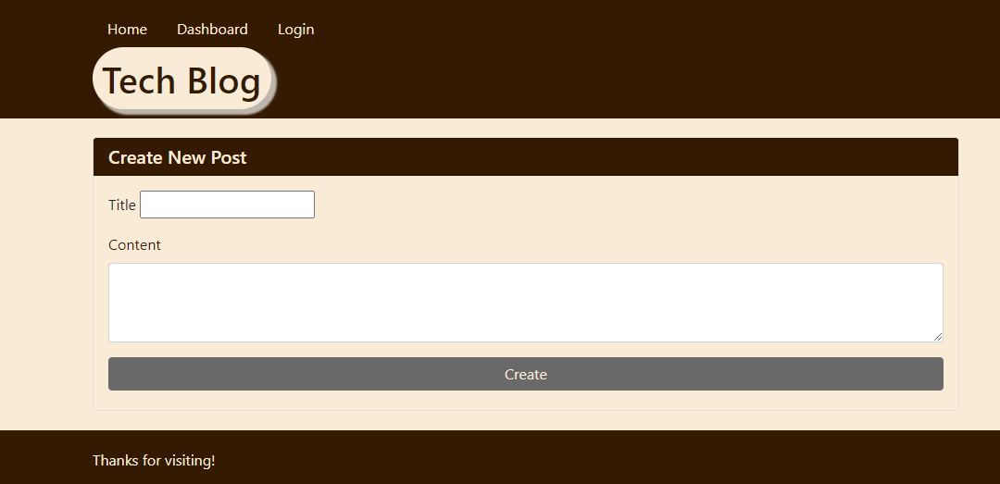

# Tech Blog

## Description

This app allows users to log in and post about anything tech related and read posts made by other people. They can also comment on other user's posts as well. Users who are not logged in can still view posts, but they cannot post themselves, nor can they comment on posts.

## Usage

The app is deployed on heroku.com. You can follow [this link](https://enigmatic-castle-72349.herokuapp.com/) to view the deployed site. While there users can login or signup and they can create, update, and delete posts when logged in. After 5 minutes of inactivity, the session expires and users will have to log in again. 

## Sample screenshots

## Questions

Please see the [github repository](https://github.com/kerbunker/tech-blog) and feel free to contact me with any questions.
